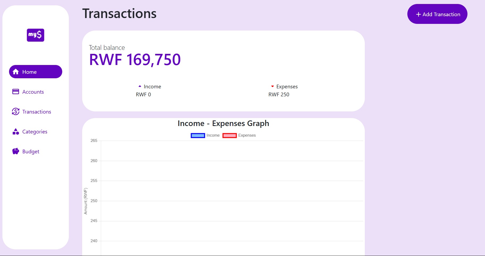

# myCents

myCents is a budgeting application designed to help users effectively manage their personal finances. The project consists of a Django backend and a React frontend, ensuring a robust and responsive experience.

## Live Demo

Access the live demo here: [myCents Live](https://coachallenge.lajiktech.com/)

**Test Credentials**

- Username: eric
- Password: eric123

## Screenshots

| Dashboard | Expense Tracker |
|-----------|-----------------|
|  |  |

## Features

- User authentication and profile management.
- Real-time budget tracking.
- Expense categorization and visualization.
- Scalability to accommodate growing user base.

## Technologies Used

- **Backend:** Django, Django REST Framework
- **Frontend:** React, Yarn
- **Database:** PostgreSQL
- **Deployment:** Docker, Nginx, Gunicorn

## Local Installation

### Prerequisites

Ensure you have the following installed:

- Python 3.13.1
- Node.js 22
- Yarn
- Docker and Docker Compose

### Backend Setup

1. Clone the repository:

   ```bash
   git clone https://github.com/sammy-techzard/mycents.git
   cd myCents/backend
   ```

2. Create and activate a virtual environment:

   ```bash
   python -m venv venv
   source venv/bin/activate  # For Linux/Mac
   venv\Scripts\activate    # For Windows
   ```

3. Copy and set up env

   ```
   cp .env.example .env # change url according FRONTEND_URL=http://localhost:3000
   ```

4. Inst sall dependencies:

   ```bash
   pip install -r requirements.txt
   ```

5. Apply migrations and start the development server:

   ```bash
   python manage.py migrate
   python manage.py runserver
   ```

### Frontend Setup

1. Navigate to the frontend directory:
   ```bash
   cd ../frontend
   ```
2. Copy and set up environment
   ```
   cp .env.example .env # change url according REACT_APP_BACKEND_URL=http://localhost:8000
   ```
3. Install dependencies:
   ```bash
   yarn install
   ```
4. Start the development server:
   ```bash
   yarn start
   ```

### Access the Application

- Backend: `http://localhost:8000`
- Frontend: `http://localhost:3000`

## Deployment

### Using Docker

1. Build and run the containers:
   ```bash
   docker-compose up --build
   ```
2. Access the app via the configured domain or `http://localhost`.

### Manual Deployment

- Backend: Use Gunicorn and Nginx to serve the Django application.
- Frontend: Build the React app and serve it using Nginx.


## License

This project is licensed under the MIT License. See the [LICENSE](LICENSE) file for details.

## Contact

For questions or feedback, please reach out to:

- Email: [niyonizerasamson100@gmail.com](mailto\:niyonizerasamson100@gmail.com)

---

Thank you for !!!

